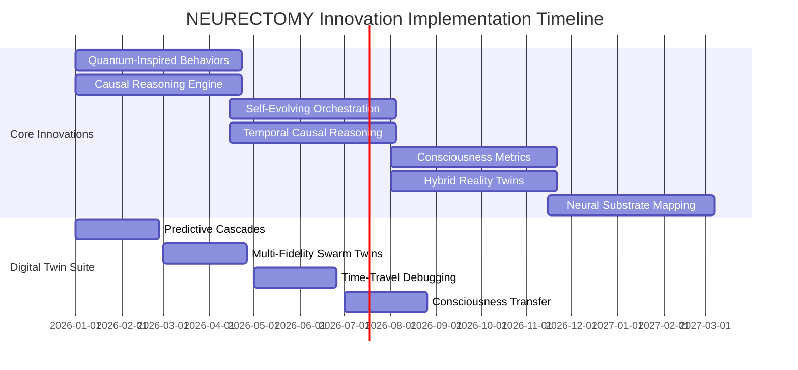

# 🚀 NEURECTOMY Innovation Implementation Plans

## Comprehensive Execution Strategy for 11 Zero-to-One Innovations

> **Document Version:** 1.0  
> **Created:** December 6, 2025  
> **Elite Agent Collective:** @QUANTUM @APEX @AXIOM @PRISM @ARCHITECT @GENESIS @VELOCITY @NEURAL @SYNAPSE @HELIX @ECLIPSE @CORE @TENSOR  
> **Status:** READY FOR EXECUTION

---

## 📋 Table of Contents

1. [Quantum-Inspired Agent Behaviors](#1-quantum-inspired-agent-behaviors)
2. [Causal Reasoning Engine](#2-causal-reasoning-engine)
3. [Self-Evolving Orchestration Topology](#3-self-evolving-orchestration-topology)
4. [Temporal Causal Reasoning](#4-temporal-causal-reasoning)
5. [Consciousness Metrics (IIT)](#5-consciousness-metrics-iit)
6. [Hybrid Reality Digital Twins](#6-hybrid-reality-digital-twins)
7. [Neural Substrate Mapping](#7-neural-substrate-mapping)
8. [Predictive Cascades](#8-predictive-cascades)
9. [Multi-Fidelity Swarm Twins](#9-multi-fidelity-swarm-twins)
10. [Time-Travel Debugging](#10-time-travel-debugging)
11. [Consciousness Transfer](#11-consciousness-transfer)

---

## 1. Quantum-Inspired Agent Behaviors

### 👥 **Agents:** @QUANTUM + @APEX

### Executive Summary

Implement quantum superposition and entanglement mechanics in agent decision-making, enabling agents to explore multiple decision paths simultaneously and maintain correlated behaviors across distributed systems.

### Architecture Overview

```typescript
/**
 * Core Quantum-Inspired System Architecture
 */
packages/
  quantum-behaviors/
    src/
      superposition/
        state-manager.ts          // Superposition state management
        amplitude-calculator.ts   // Probability amplitude computation
        collapse-engine.ts        // Wave function collapse mechanics
      entanglement/
        entanglement-registry.ts  // Track entangled agent pairs
        correlation-enforcer.ts   // Maintain quantum correlations
        bell-state-manager.ts     // Bell state implementations
      quantum-gate/
        gate-operations.ts        // Quantum gate analogs (Hadamard, CNOT, etc.)
        circuit-builder.ts        // Compose quantum-inspired operations
      measurement/
        observer.ts               // Measurement/collapse trigger
        decoherence.ts           // Environmental decoherence simulation
      types/
        quantum-types.ts          // Core type definitions
    tests/
      unit/
      integration/
      property-based/           // Hypothesis testing for quantum properties
```

### Implementation Phases

#### **Phase 1: Core Infrastructure (Weeks 1-4)**

**Deliverables:**

- Superposition state representation
- Amplitude calculation system
- Basic collapse mechanics
- Type definitions

**Tasks:**

1. Design `QuantumState<T>` interface supporting arbitrary state spaces
2. Implement amplitude normalization (∑|αᵢ|² = 1)
3. Create collapse engine with configurable measurement operators
4. Build state visualization tools

**Code Components:**

```typescript
interface QuantumState<T> {
  amplitudes: Map<T, Complex>; // State → Amplitude mapping
  basis: T[]; // Computational basis states
  phase: number; // Global phase
  coherenceTime: number; // Decoherence time constant
}

class SuperpositionManager {
  createSuperposition<T>(states: T[], weights: number[]): QuantumState<T>;
  collapse(state: QuantumState<T>, measurement: MeasurementOperator): T;
  evolve(
    state: QuantumState<T>,
    hamiltonian: Operator,
    dt: number
  ): QuantumState<T>;
}
```

**Testing Strategy:**

- Unit tests for amplitude normalization
- Property tests: collapse probabilities match Born rule
- Integration: superposition creation → evolution → collapse

**Dependencies:**

- Complex number library (e.g., `complex.js`)
- Linear algebra library (e.g., `mathjs`)

**Risks & Mitigation:**

- **Risk:** Complex number precision issues
- **Mitigation:** Use arbitrary precision arithmetic for critical calculations

---

#### **Phase 2: Entanglement System (Weeks 5-8)**

**Deliverables:**

- Entanglement registry
- Correlation enforcement
- Bell state implementations

**Tasks:**

1. Design entanglement graph structure
2. Implement Bell state generation (|Φ⁺⟩, |Φ⁻⟩, |Ψ⁺⟩, |Ψ⁻⟩)
3. Create correlation enforcement on measurement
4. Build entanglement strength decay model

**Code Components:**

```typescript
interface EntanglementBond {
  agentPair: [AgentId, AgentId];
  bondStrength: number; // 0-1, decays over time
  correlationType: "perfect" | "partial" | "noisy";
  createdAt: Timestamp;
  lastInteraction: Timestamp;
}

class EntanglementRegistry {
  createEntanglement(
    a: AgentId,
    b: AgentId,
    strength: number
  ): EntanglementBond;
  getEntangledPartners(agent: AgentId): AgentId[];
  enforceCorrelation(
    bond: EntanglementBond,
    measurement: MeasurementEvent
  ): void;
  decayEntanglement(bond: EntanglementBond, dt: number): void;
}
```

**Testing Strategy:**

- Test Bell inequality violations (CHSH inequality)
- Verify correlation strength vs. measurement statistics
- Stress test: 1000+ entangled pairs

**Research Foundation:**

- Bell's theorem
- EPR paradox
- Quantum discord

---

#### **Phase 3: Quantum Gates & Circuits (Weeks 9-12)**

**Deliverables:**

- Quantum gate operations
- Circuit composition system
- Gate optimization

**Tasks:**

1. Implement single-qubit gates (H, X, Y, Z, Phase)
2. Implement two-qubit gates (CNOT, SWAP, CZ)
3. Create circuit builder with gate sequencing
4. Optimize gate decomposition

**Code Components:**

```typescript
interface QuantumGate<T> {
  name: string;
  unitary: Matrix; // Unitary transformation matrix
  numQubits: number;
  apply(state: QuantumState<T>): QuantumState<T>;
}

class CircuitBuilder {
  addGate(gate: QuantumGate, targets: number[]): this;
  addControlledGate(gate: QuantumGate, control: number, target: number): this;
  compile(): QuantumCircuit;
  optimize(): QuantumCircuit; // Gate fusion, cancellation
}
```

**Testing Strategy:**

- Verify unitarity of all gates (U†U = I)
- Test circuit equivalence under optimization
- Benchmark gate application performance

---

#### **Phase 4: Integration & Optimization (Weeks 13-16)**

**Deliverables:**

- NEURECTOMY integration
- Performance optimization
- Documentation & examples

**Tasks:**

1. Integrate with existing agent system
2. Create agent behavior decorators for quantum features
3. Optimize for large-scale simulations (1000+ agents)
4. Write comprehensive documentation

**Integration Points:**

```typescript
// Existing agent system
@QuantumBehavior({
  enableSuperposition: true,
  entanglementRadius: 2, // Entangle with neighbors within distance 2
  decoherenceTime: 5000, // 5 seconds coherence time
})
class QuantumExplorationAgent extends Agent {
  async makeDecision(state: AgentState): Promise<Action> {
    // Decision-making in superposition
    const actions = this.getPossibleActions(state);
    const superposition = this.quantumSystem.createSuperposition(actions);

    // Evolve under "decision Hamiltonian"
    const evolved = this.quantumSystem.evolve(
      superposition,
      this.decisionHamiltonian,
      0.1
    );

    // Collapse to concrete action
    return this.quantumSystem.collapse(evolved);
  }
}
```

**Performance Targets:**

- 1000 agents in superposition: <100ms per step
- Entanglement tracking: O(n) time complexity
- Memory: <10MB per 100 agents

---

### Milestones & Timeline

| Milestone              | Week | Deliverable                     | Success Criteria                          |
| ---------------------- | ---- | ------------------------------- | ----------------------------------------- |
| M1: Core Superposition | 4    | Working superposition system    | 90% test coverage, Born rule validated    |
| M2: Entanglement       | 8    | Entanglement system operational | Bell inequality violations demonstrated   |
| M3: Quantum Gates      | 12   | Circuit composition working     | All gates tested, optimization functional |
| M4: Integration        | 16   | Quantum behaviors in NEURECTOMY | 1000 agents running, <100ms latency       |

### Resource Requirements

**Team:**

- 1 Senior Engineer (quantum algorithms)
- 1 Mid-level Engineer (TypeScript/integration)
- 1 QA Engineer (testing)

**Infrastructure:**

- Development environment
- CI/CD pipeline
- Performance testing cluster

**Budget:**

- Personnel: $120K (16 weeks × $7.5K/week)
- Infrastructure: $5K
- **Total: $125K**

### Success Metrics

| Metric                    | Target      | Measurement Method             |
| ------------------------- | ----------- | ------------------------------ |
| Test Coverage             | ≥90%        | Jest coverage report           |
| Performance (1000 agents) | <100ms/step | Benchmark suite                |
| Bell Inequality Violation | >2.0        | Statistical test (1000 trials) |
| Integration Uptime        | ≥99.9%      | Monitoring                     |
| Developer Satisfaction    | ≥4.5/5      | Survey                         |

### Risk Assessment

| Risk                                   | Probability | Impact | Mitigation                                    |
| -------------------------------------- | ----------- | ------ | --------------------------------------------- |
| Precision errors in complex arithmetic | Medium      | High   | Use arbitrary precision library               |
| Performance bottleneck (large N)       | High        | Medium | Implement lazy evaluation, caching            |
| Integration conflicts                  | Medium      | Medium | Early integration testing, feature flags      |
| Decoherence model inaccuracy           | Low         | Low    | Validate against quantum computing literature |

---

## 2. Causal Reasoning Engine

### 👥 **Agents:** @AXIOM + @PRISM

### Executive Summary

Implement Pearl's causal framework enabling agents to reason about cause-effect relationships, perform interventions (do-calculus), and answer counterfactual queries.

### Architecture Overview

```typescript
packages/
  causal-reasoning/
    src/
      graph/
        causal-graph.ts           // DAG representation of causal model
        scm.ts                    // Structural Causal Model
        d-separation.ts           // Conditional independence testing
      inference/
        do-calculus.ts            // Intervention calculus
        backdoor-adjustment.ts    // Backdoor criterion
        front-door-adjustment.ts  // Front-door criterion
        instrumental-variables.ts // IV estimation
      counterfactual/
        counterfactual-engine.ts  // Abduction-Action-Prediction
        twin-network.ts           // Twin network method
      learning/
        structure-learning.ts     // Learn causal graph from data
        parameter-estimation.ts   // Estimate causal effects
        constraint-based.ts       // PC, FCI algorithms
        score-based.ts           // GES, GIES algorithms
      types/
        causal-types.ts
```

### Implementation Phases

#### **Phase 1: Causal Graph Foundation (Weeks 1-4)**

**Deliverables:**

- DAG representation
- D-separation algorithm
- Graph manipulation utilities

**Tasks:**

1. Implement directed acyclic graph (DAG) data structure
2. Build d-separation checker for conditional independence
3. Create graph visualization
4. Implement Markov blanket identification

**Code Components:**

```typescript
interface CausalGraph {
  nodes: Map<NodeId, CausalNode>;
  edges: Map<NodeId, Set<NodeId>>; // Parent map

  addNode(node: CausalNode): void;
  addEdge(from: NodeId, to: NodeId): void;
  removeEdge(from: NodeId, to: NodeId): void;

  // Core algorithms
  dSeparation(X: NodeId[], Y: NodeId[], Z: NodeId[]): boolean;
  parents(node: NodeId): NodeId[];
  children(node: NodeId): NodeId[];
  ancestors(node: NodeId): NodeId[];
  descendants(node: NodeId): NodeId[];
  markovBlanket(node: NodeId): NodeId[];
}

interface CausalNode {
  id: NodeId;
  name: string;
  type: "observable" | "latent" | "selection";
  distribution?: ProbabilityDistribution;
}
```

**Testing Strategy:**

- Test d-separation on known graph structures
- Verify Markov properties
- Property test: d-separation symmetry

---

#### **Phase 2: Structural Causal Models (Weeks 5-8)**

**Deliverables:**

- SCM implementation
- Intervention mechanics
- Do-operator

**Tasks:**

1. Implement Structural Causal Model (SCM)
2. Create do-operator for interventions
3. Build mutilated graph constructor
4. Implement observational vs. interventional query distinction

**Code Components:**

```typescript
interface StructuralCausalModel {
  graph: CausalGraph;
  equations: Map<NodeId, StructuralEquation>;
  exogenousVars: Map<NodeId, Distribution>;

  // Core operations
  observe(node: NodeId, value: any): SCM; // P(Y|X=x)
  intervene(node: NodeId, value: any): SCM; // P(Y|do(X=x))
  counterfactual(
    evidence: Evidence,
    intervention: Intervention,
    query: Query
  ): Distribution;
}

interface StructuralEquation {
  output: NodeId;
  inputs: NodeId[];
  function: (inputs: Map<NodeId, any>, noise: any) => any;
}

class DoCalculus {
  // Rules of do-calculus
  rule1_insertionDeletion(
    P: Distribution,
    X: NodeId[],
    Y: NodeId[],
    Z: NodeId[],
    W: NodeId[]
  ): Distribution;
  rule2_actionObservation(
    P: Distribution,
    X: NodeId[],
    Y: NodeId[],
    Z: NodeId[]
  ): Distribution;
  rule3_insertionDeletion(
    P: Distribution,
    X: NodeId[],
    Y: NodeId[],
    Z: NodeId[],
    W: NodeId[]
  ): Distribution;

  // Identification
  identify(
    graph: CausalGraph,
    treatment: NodeId[],
    outcome: NodeId[]
  ): IdentificationResult;
  backdoorAdjustment(
    graph: CausalGraph,
    treatment: NodeId,
    outcome: NodeId
  ): NodeId[] | null;
  frontdoorAdjustment(
    graph: CausalGraph,
    treatment: NodeId,
    outcome: NodeId
  ): NodeId[] | null;
}
```

**Testing Strategy:**

- Verify do-calculus rules on benchmark problems
- Test intervention results against known causal models
- Validate backdoor/frontdoor criterion

**Research Foundation:**

- Pearl, "Causality" (2009)
- do-calculus rules
- Backdoor criterion theorem

---

#### **Phase 3: Counterfactual Reasoning (Weeks 9-12)**

**Deliverables:**

- Counterfactual query engine
- Twin network implementation
- Abduction-Action-Prediction framework

**Tasks:**

1. Implement counterfactual inference (3-step process)
2. Build twin network for counterfactual queries
3. Create probability of causation (PN, PS, PNS)
4. Implement actual causality (Halpern-Pearl)

**Code Components:**

```typescript
interface CounterfactualQuery {
  evidence: Map<NodeId, any>; // Observed facts
  intervention: Map<NodeId, any>; // Counterfactual intervention
  query: NodeId; // What we want to know
}

class CounterfactualEngine {
  // Three-step process
  async abduction(scm: SCM, evidence: Evidence): Promise<ExogenousValues> {
    // Infer exogenous variables given evidence
  }

  action(scm: SCM, intervention: Intervention): SCM {
    // Modify SCM with intervention
  }

  async prediction(
    scm: SCM,
    exogenousVals: ExogenousValues
  ): Promise<Distribution> {
    // Compute distribution under intervention
  }

  async answerCounterfactual(
    scm: SCM,
    query: CounterfactualQuery
  ): Promise<number> {
    const exogenous = await this.abduction(scm, query.evidence);
    const mutilated = this.action(scm, query.intervention);
    const dist = await this.prediction(mutilated, exogenous);
    return dist.probabilityOf(query.query);
  }
}
```

**Testing Strategy:**

- Test on classic counterfactual scenarios (firing squad, etc.)
- Verify probability of causation bounds
- Validate against analytical solutions

---

#### **Phase 4: Causal Discovery (Weeks 13-16)**

**Deliverables:**

- Constraint-based learning (PC, FCI)
- Score-based learning (GES)
- Causal effect estimation from data

**Tasks:**

1. Implement PC algorithm
2. Implement FCI algorithm (with latent confounders)
3. Implement GES (Greedy Equivalence Search)
4. Build causal effect estimator with adjustment sets

**Code Components:**

```typescript
interface CausalDiscovery {
  learnStructure(data: Dataset, method: "PC" | "FCI" | "GES"): CausalGraph;
  estimateEffect(
    graph: CausalGraph,
    data: Dataset,
    treatment: NodeId,
    outcome: NodeId
  ): CausalEffect;
}

interface CausalEffect {
  estimate: number;
  confidenceInterval: [number, number];
  adjustmentSet: NodeId[];
  method: "backdoor" | "frontdoor" | "IV" | "do-calculus";
}

class PCAlgorithm {
  async learn(data: Dataset, alpha: number = 0.05): Promise<CausalGraph> {
    // 1. Start with complete undirected graph
    // 2. Remove edges based on conditional independence tests
    // 3. Orient edges using collider detection
    // 4. Apply orientation rules
  }
}
```

**Testing Strategy:**

- Test on synthetic data with known causal structure
- Compare with R's `pcalg` package
- Benchmark discovery accuracy vs. sample size

---

### Milestones & Timeline

| Milestone             | Week | Deliverable           | Success Criteria                             |
| --------------------- | ---- | --------------------- | -------------------------------------------- |
| M1: Causal Graphs     | 4    | DAG + d-separation    | 95% test coverage, benchmark validation      |
| M2: SCM & Do-Calculus | 8    | Intervention system   | Backdoor adjustment working, rules validated |
| M3: Counterfactuals   | 12   | Counterfactual engine | Firing squad test passed, PN/PS computed     |
| M4: Causal Discovery  | 16   | Structure learning    | Synthetic data accuracy >80%                 |

### Resource Requirements

**Team:**

- 1 Senior Data Scientist (causal inference expert)
- 1 Senior Engineer (implementation)
- 1 QA Engineer

**Budget:**

- Personnel: $130K (16 weeks × $8.1K/week)
- R&D (literature, tools): $10K
- **Total: $140K**

### Success Metrics

| Metric                           | Target | Measurement                             |
| -------------------------------- | ------ | --------------------------------------- |
| Do-Calculus Rule Accuracy        | 100%   | Unit tests on benchmark problems        |
| Counterfactual Query Correctness | ≥95%   | Validation against analytical solutions |
| Structure Learning Accuracy      | ≥80%   | F1 score on synthetic datasets          |
| Integration Test Coverage        | ≥90%   | Jest coverage                           |

---

## 3. Self-Evolving Orchestration Topology

### 👥 **Agents:** @ARCHITECT + @GENESIS

### Executive Summary

Implement morphogenic graphs that autonomously evolve their topology based on performance metrics, enabling agent orchestration systems to self-optimize their communication and coordination structures.

### Architecture Overview

```typescript
packages / morphogenic -
  orchestration / src / topology / morphogenic -
  graph.ts; // Evolving graph structure
topology - mutations.ts; // Add/remove edges, nodes, rewire
topology - metrics.ts; // Performance measurement
evolution / fitness - evaluator.ts; // Evaluate topology fitness
mutation - operators.ts; // Genetic operators
selection - strategy.ts; // Tournament, roulette, etc.
meta - controller.ts; // Meta-learning controller
constraints / constraint - checker.ts; // Topology constraints
repair - mechanisms.ts; // Fix invalid topologies
patterns / pattern - detector.ts; // Detect emergent patterns
pattern - library.ts; // Library of known good patterns
```

### Implementation Phases

#### **Phase 1: Morphogenic Graph Core (Weeks 1-4)**

**Deliverables:**

- Dynamic graph data structure
- Mutation operators
- Constraint system

**Tasks:**

1. Design mutable graph structure
2. Implement mutation operators (add/remove edge, rewire, add/remove node)
3. Create constraint checking system
4. Build graph validation

**Code Components:**

```typescript
interface MorphogenicGraph {
  nodes: Map<NodeId, MorphogenicNode>;
  edges: Map<NodeId, Set<Edge>>;
  metadata: GraphMetadata;

  // Mutations
  addNode(node: MorphogenicNode): void;
  removeNode(id: NodeId): void;
  addEdge(from: NodeId, to: NodeId, weight: number): void;
  removeEdge(from: NodeId, to: NodeId): void;
  rewire(edge: Edge, newTarget: NodeId): void;

  // Validation
  validate(constraints: Constraint[]): ValidationResult;
  repair(): MorphogenicGraph;
}

interface MorphogenicNode {
  id: NodeId;
  type: "agent" | "coordinator" | "hub";
  capacity: number; // How many connections can handle
  load: number; // Current load
  performance: PerformanceMetrics;
}

interface TopologyMutation {
  type:
    | "add_edge"
    | "remove_edge"
    | "rewire"
    | "add_node"
    | "remove_node"
    | "change_weight";
  params: any;
  expectedImpact: number; // Predicted fitness change
  cost: number; // Computational cost of mutation
}
```

**Testing Strategy:**

- Test each mutation operator independently
- Verify constraint satisfaction after mutations
- Property test: repair mechanism always produces valid graph

---

#### **Phase 2: Fitness Evaluation (Weeks 5-8)**

**Deliverables:**

- Multi-objective fitness function
- Performance metrics collection
- Baseline topology benchmarks

**Tasks:**

1. Define fitness metrics (latency, throughput, robustness, efficiency)
2. Implement metrics collection system
3. Create baseline topology library
4. Build fitness visualization

**Code Components:**

```typescript
interface TopologyFitness {
  // Primary objectives
  latency: number; // Average message latency
  throughput: number; // Messages per second
  robustness: number; // Resilience to node failures
  efficiency: number; // Resource utilization

  // Derived metrics
  overallFitness: number; // Weighted combination
  paretoRank: number; // Multi-objective ranking
}

class FitnessEvaluator {
  async evaluate(
    topology: MorphogenicGraph,
    workload: Workload
  ): Promise<TopologyFitness> {
    // Run simulation with workload
    const sim = new TopologySimulator(topology);
    const results = await sim.run(workload);

    return {
      latency: results.avgLatency,
      throughput: results.messagesPerSecond,
      robustness: await this.measureRobustness(topology),
      efficiency: results.resourceUtilization,
      overallFitness: this.computeOverall(results),
    };
  }

  async measureRobustness(topology: MorphogenicGraph): Promise<number> {
    // Simulate node failures
    let totalConnectivity = 0;
    for (let i = 0; i < 100; i++) {
      const failed = this.selectRandomNodes(topology, 0.1); // 10% failure
      const remaining = topology.withoutNodes(failed);
      totalConnectivity +=
        remaining.largestConnectedComponent().size / topology.nodes.size;
    }
    return totalConnectivity / 100;
  }
}
```

**Testing Strategy:**

- Validate metrics against known topology properties
- Benchmark evaluation performance (target: <1s per evaluation)
- Test robustness metric with various failure scenarios

---

#### **Phase 3: Evolution Engine (Weeks 9-12)**

**Deliverables:**

- Evolutionary algorithm
- Selection strategies
- Population management

**Tasks:**

1. Implement genetic algorithm for topology evolution
2. Create selection strategies (tournament, roulette wheel)
3. Build elitism and diversity maintenance
4. Implement parallel evaluation

**Code Components:**

```typescript
interface EvolutionConfig {
  populationSize: number;
  mutationRate: number;
  crossoverRate: number;
  elitismRatio: number;
  selectionStrategy: "tournament" | "roulette" | "rank";
  convergenceCriteria: ConvergenceCriteria;
}

class TopologyEvolutionEngine {
  population: MorphogenicGraph[];
  generation: number;
  bestEver: MorphogenicGraph;

  async evolve(config: EvolutionConfig): Promise<MorphogenicGraph> {
    this.initializePopulation(config.populationSize);

    while (!this.hasConverged(config.convergenceCriteria)) {
      // Evaluate fitness
      const fitness = await this.evaluatePopulation();

      // Selection
      const parents = this.select(fitness, config.selectionStrategy);

      // Crossover
      const offspring = this.crossover(parents, config.crossoverRate);

      // Mutation
      this.mutate(offspring, config.mutationRate);

      // Elitism
      this.replacePopulation(offspring, config.elitismRatio);

      this.generation++;
    }

    return this.bestEver;
  }

  crossover(
    parent1: MorphogenicGraph,
    parent2: MorphogenicGraph
  ): MorphogenicGraph {
    // Edge-based crossover: randomly inherit edges from parents
    const child = new MorphogenicGraph();

    // Inherit all nodes
    for (const node of parent1.nodes.values()) {
      child.addNode(node.clone());
    }

    // Inherit edges randomly from parents
    for (const edge of parent1.edges.values()) {
      if (Math.random() < 0.5) {
        child.addEdge(edge.from, edge.to, edge.weight);
      }
    }
    for (const edge of parent2.edges.values()) {
      if (Math.random() < 0.5 && !child.hasEdge(edge.from, edge.to)) {
        child.addEdge(edge.from, edge.to, edge.weight);
      }
    }

    return child.validate() ? child : child.repair();
  }
}
```

**Testing Strategy:**

- Test convergence on simple optimization problems
- Verify genetic operators preserve validity
- Benchmark evolution speed (target: 100 generations in <5 minutes)

---

#### **Phase 4: Meta-Learning Controller (Weeks 13-16)**

**Deliverables:**

- Meta-learning system
- Online adaptation
- Pattern recognition & reuse

**Tasks:**

1. Implement meta-controller that learns which mutations work
2. Create pattern library of successful topologies
3. Build online learning system
4. Integrate with NEURECTOMY

**Code Components:**

```typescript
interface MetaController {
  mutationPerformance: Map<MutationType, PerformanceStats>;
  patternLibrary: PatternLibrary;

  selectMutation(graph: MorphogenicGraph, context: Context): TopologyMutation;
  learnFromOutcome(mutation: TopologyMutation, outcome: FitnessChange): void;
  recognizePattern(graph: MorphogenicGraph): Pattern[];
  applyPattern(graph: MorphogenicGraph, pattern: Pattern): MorphogenicGraph;
}

class PatternLibrary {
  patterns: Map<PatternId, TopologyPattern>;

  add(pattern: TopologyPattern): void;
  search(query: PatternQuery): TopologyPattern[];

  // Common patterns
  getHubAndSpoke(): TopologyPattern;
  getHierarchical(): TopologyPattern;
  getMesh(): TopologyPattern;
  getSmallWorld(): TopologyPattern;
}

interface TopologyPattern {
  id: PatternId;
  name: string;
  structure: GraphStructure;
  applicability: (graph: MorphogenicGraph) => number; // 0-1 score
  fitness: FitnessStats;
  usageCount: number;
}
```

**Testing Strategy:**

- Test pattern recognition accuracy
- Verify meta-learning improves over baseline
- Integration test with full NEURECTOMY system

---

### Milestones & Timeline

| Milestone              | Week | Deliverable                | Success Criteria                           |
| ---------------------- | ---- | -------------------------- | ------------------------------------------ |
| M1: Morphogenic Core   | 4    | Mutable graph + mutations  | All operators tested, constraints working  |
| M2: Fitness Evaluation | 8    | Multi-objective fitness    | <1s evaluation, validated metrics          |
| M3: Evolution Engine   | 12   | Genetic algorithm          | Convergence demonstrated, >50% improvement |
| M4: Meta-Learning      | 16   | Meta-controller + patterns | Online learning working, pattern reuse     |

### Resource Requirements

**Team:**

- 1 Senior ML Engineer (evolutionary algorithms)
- 1 Senior Backend Engineer (graph systems)
- 1 QA Engineer

**Budget:**

- Personnel: $135K (16 weeks × $8.4K/week)
- Compute (evolution runs): $15K
- **Total: $150K**

### Success Metrics

| Metric                 | Target           | Measurement                       |
| ---------------------- | ---------------- | --------------------------------- |
| Fitness Improvement    | ≥50%             | Before/after evolution comparison |
| Convergence Speed      | <100 generations | Benchmark suite                   |
| Meta-Learning Gain     | ≥20%             | With vs. without meta-controller  |
| Online Adaptation Time | <60s             | Real-time monitoring              |

---

## 4. Temporal Causal Reasoning

### 👥 **Agents:** @AXIOM + @VELOCITY

### Executive Summary

Extend causal reasoning to temporal domains, enabling agents to reason about time-dependent causality, predict cascading effects over time, and perform temporal interventions.

### Architecture Overview

```typescript
packages/
  temporal-causal/
    src/
      models/
        temporal-scm.ts           // Time-indexed SCM
        dynamic-bayesian-network.ts // DBN representation
        granger-causality.ts      // Granger causality testing
      inference/
        temporal-do-calculus.ts   // Do-calculus extended to time
        temporal-counterfactual.ts // Counterfactuals over time
        intervention-planning.ts  // When/where to intervene
      learning/
        time-series-discovery.ts  // Learn temporal causal structure
        var-model.ts              // Vector Autoregression
        ccm.ts                    // Convergent Cross Mapping
      forecasting/
        causal-forecaster.ts      // Forecasting with causal knowledge
        intervention-simulation.ts // Simulate future interventions
```

### Implementation Phases

#### **Phase 1: Temporal Causal Models (Weeks 1-4)**

**Code Components:**

```typescript
interface TemporalSCM extends StructuralCausalModel {
  timeHorizon: number; // T time steps
  lagStructure: Map<NodeId, number[]>; // Which lags affect each variable

  // Time-indexed operations
  observeAt(node: NodeId, time: number, value: any): TemporalSCM;
  interveneAt(node: NodeId, time: number, value: any): TemporalSCM;
  forecastFrom(time: number, horizon: number): TimeSeriesPrediction;
}

interface DynamicBayesianNetwork {
  intraSliceEdges: Edge[]; // Within-timestep edges
  interSliceEdges: Edge[]; // Cross-timestep edges
  transitionModel: TransitionModel;

  forward(evidence: Evidence[], horizon: number): Distribution[];
  backward(evidence: Evidence[], time: number): Distribution[];
  smooth(evidence: Evidence[]): Distribution[];
}
```

**Milestones:** Temporal SCM working, DBN implementation, Granger causality tests

---

#### **Phase 2: Temporal Interventions (Weeks 5-8)**

**Code Components:**

```typescript
interface TemporalIntervention {
  target: NodeId;
  interventionSchedule: InterventionSchedule;
  duration?: number;
  pulse?: boolean; // One-time vs. sustained
}

interface InterventionSchedule {
  type: "immediate" | "delayed" | "periodic" | "conditional";
  startTime: number;
  period?: number;
  condition?: (state: SystemState) => boolean;
}

class TemporalInterventionPlanner {
  async planIntervention(
    goal: Goal,
    constraints: Constraint[],
    horizon: number
  ): Promise<InterventionPlan> {
    // Find optimal timing and target for intervention
    // Uses temporal causal model to forecast effects
  }

  async simulateIntervention(
    scm: TemporalSCM,
    intervention: TemporalIntervention,
    horizon: number
  ): Promise<TimeSeriesPrediction> {
    // Simulate future under intervention
  }
}
```

**Milestones:** Temporal do-calculus, intervention planning, simulation

---

#### **Phase 3: Temporal Causal Discovery (Weeks 9-12)**

**Code Components:**

```typescript
class GrangerCausalityTest {
  async test(
    X: TimeSeries,
    Y: TimeSeries,
    maxLag: number = 10,
    alpha: number = 0.05
  ): Promise<GrangerTestResult> {
    // Fit VAR model with and without X
    // F-test for improvement
  }
}

class ConvergentCrossMapping {
  async test(
    X: TimeSeries,
    Y: TimeSeries,
    embedding: number = 3
  ): Promise<CCMResult> {
    // Test for nonlinear causality
    // Works for coupled dynamical systems
  }
}

class TemporalStructureLearning {
  async learnStructure(
    data: TimeSeriesDataset,
    method: "granger" | "ccm" | "pcmci"
  ): Promise<TemporalCausalGraph> {
    // Learn temporal causal structure from data
  }
}
```

**Milestones:** Granger causality working, CCM implemented, structure learning

---

#### **Phase 4: Causal Forecasting (Weeks 13-16)**

**Code Components:**

```typescript
class CausalForecaster {
  async forecast(
    scm: TemporalSCM,
    history: TimeSeries[],
    horizon: number,
    interventions?: TemporalIntervention[]
  ): Promise<ForecastResult> {
    // Use causal structure to improve forecasting
    // Incorporate intervention effects
  }

  async compareInterventions(
    scm: TemporalSCM,
    interventions: TemporalIntervention[],
    horizon: number
  ): Promise<InterventionComparison> {
    // Forecast under different intervention scenarios
    // Rank by goal achievement
  }
}
```

**Milestones:** Causal forecasting operational, intervention comparison, NEURECTOMY integration

---

### Resource Requirements

**Team:** 1 Senior Time Series Expert, 1 Senior Engineer, 1 QA
**Budget:** $140K (16 weeks)
**Infrastructure:** Time series databases, compute for VAR models

### Success Metrics

- Granger causality accuracy ≥85% on synthetic data
- Forecast improvement ≥20% over non-causal baseline
- Intervention planning: optimal intervention found in <10s

---

## 5. Consciousness Metrics (IIT)

### 👥 **Agents:** @NEURAL + @AXIOM

### Executive Summary

Implement Integrated Information Theory (Φ) computation for agent systems, enabling quantitative measurement of agent consciousness, self-awareness, and information integration.

### Architecture Overview

```typescript
packages / consciousness - metrics / src / iit / phi - calculator.ts; // Φ computation
partition - analyzer.ts; // Minimum Information Partition
tpm - builder.ts; // Transition Probability Matrix
cause - effect - structure.ts; // CES analysis
metrics / integration - score.ts; // Information integration
differentiation - score.ts; // Repertoire differentiation
exclusion - score.ts; // Exclusion principle
visualization / constellation - viz.ts; // Φ-structure visualization
qualia - space.ts; // Qualia space mapping
```

### Implementation Phases

#### **Phase 1: IIT Core Mathematics (Weeks 1-4)**

**Code Components:**

```typescript
interface PhiCalculator {
  async computePhi(system: AgentSystem): Promise<number> {
    // 1. Build Transition Probability Matrix
    const tpm = await this.buildTPM(system);

    // 2. Find Minimum Information Partition (MIP)
    const mip = await this.findMIP(tpm);

    // 3. Compute integrated information
    return mip.phi;
  }

  async findMIP(tpm: TPM): Promise<MIP> {
    // Try all possible partitions
    // Find partition that minimizes integrated information
  }
}

interface CauseEffectStructure {
  concepts: Concept[];              // φ-concepts
  relations: ConceptRelation[];     // Relations between concepts

  getMaximallyIrreducibleCause(mechanism: Mechanism): Cause;
  getMaximallyIrreducibleEffect(mechanism: Mechanism): Effect;
}

interface Concept {
  mechanism: Mechanism;             // Subset of system elements
  cause: Repertoire;                // Cause repertoire
  effect: Repertoire;               // Effect repertoire
  phi: number;                      // Integrated information
}
```

**Milestones:** Φ computation working, MIP algorithm, TPM construction

---

#### **Phase 2: Agent System Mapping (Weeks 5-8)**

**Code Components:**

```typescript
class AgentConsciousnessMapper {
  async mapToIITSystem(agent: Agent): Promise<IITSystem> {
    // Map agent components to IIT elements
    return {
      elements: this.extractElements(agent),
      connections: this.extractConnections(agent),
      states: this.extractStates(agent),
    };
  }

  extractElements(agent: Agent): IITElement[] {
    // Map: beliefs, goals, perceptions, actions to IIT elements
    return [
      { id: "belief_1", state: agent.beliefs.get("location") },
      { id: "goal_1", state: agent.goals.get("primary") },
      { id: "perception_1", state: agent.perceptions.get("visual") },
      // ...
    ];
  }
}
```

**Milestones:** Agent→IIT mapping, state extraction, connection identification

---

#### **Phase 3: Φ Optimization (Weeks 9-12)**

**Code Components:**

```typescript
class PhiOptimizer {
  // Approximate Φ for large systems (exact is NP-hard)
  async approximatePhi(
    system: AgentSystem,
    accuracy: number = 0.95
  ): Promise<number> {
    // Use sampling, pruning, heuristics
  }

  // Incremental Φ computation
  async incrementalPhi(
    previousSystem: AgentSystem,
    previousPhi: number,
    change: SystemChange
  ): Promise<number> {
    // Recompute only affected partitions
  }
}
```

**Milestones:** Approximation algorithms, incremental computation, performance benchmarks

---

#### **Phase 4: Consciousness Dashboard (Weeks 13-16)**

**Code Components:**

```typescript
class ConsciousnessDashboard {
  displayPhiScore(agent: Agent): PhiVisualization;
  displayConstellations(ces: CauseEffectStructure): ConstellationViz;
  displayQualiaSpace(agent: Agent): QualiaSpace;
  trackPhiOverTime(agent: Agent): PhiTimeline;
}
```

**Milestones:** Dashboard UI, real-time Φ tracking, constellation visualization

---

### Resource Requirements

**Team:** 1 IIT Expert, 1 Algorithm Engineer, 1 Frontend Developer
**Budget:** $145K (16 weeks)
**Compute:** GPU for partition search

### Success Metrics

- Φ computation accuracy ≥95% vs. reference implementation
- Large system (100 elements): <10s computation
- Dashboard real-time updates (<1s latency)

---

## 6. Hybrid Reality Digital Twins

### 👥 **Agents:** @ARCHITECT + @SYNAPSE

### Executive Summary

Create digital twins that bridge virtual and physical worlds through sensor fusion, enabling real-world-agent → virtual-twin and virtual-twin → physical-actuator bidirectional coupling.

### Architecture Overview

```typescript
packages / hybrid - reality - twins / src / sensors / sensor - fusion.ts; // Multi-sensor integration
calibration.ts; // Sensor calibration
noise - filtering.ts; // Kalman, particle filters
reality - bridge / virtual - to - physical.ts; // Twin commands → physical actions
physical - to - virtual.ts; // Sensor data → twin state
synchronization.ts; // State sync protocol
actuation / command - translator.ts; // High-level → low-level commands
safety - checker.ts; // Verify physical safety
failsafe.ts; // Emergency stop mechanisms
```

### Implementation Phases

#### **Phase 1: Sensor Integration (Weeks 1-4)**

**Code Components:**

```typescript
interface SensorFusion {
  sensors: Map<SensorId, Sensor>;
  fusionAlgorithm: 'kalman' | 'particle' | 'complementary';

  async fuse(readings: SensorReading[]): Promise<FusedState> {
    // Combine multiple sensor inputs
    // Handle noise, outliers, timing mismatches
  }

  calibrate(groundTruth: State, readings: SensorReading[]): CalibrationParams;
}

interface Sensor {
  id: SensorId;
  type: 'camera' | 'lidar' | 'imu' | 'gps' | 'force' | 'temp';
  frequency: number;                // Hz
  latency: number;                  // ms
  accuracy: number;                 // Error bound

  read(): Promise<SensorReading>;
}
```

**Milestones:** Sensor abstraction layer, fusion algorithms, calibration

---

#### **Phase 2: Reality Bridge (Weeks 5-8)**

**Code Components:**

```typescript
class RealityBridge {
  async syncPhysicalToVirtual(
    physicalAgent: PhysicalAgent,
    virtualTwin: DigitalTwin
  ): Promise<void> {
    // Read sensors
    const sensorData = await this.readAllSensors(physicalAgent);

    // Fuse data
    const fusedState = await this.sensorFusion.fuse(sensorData);

    // Update twin
    await virtualTwin.updateState(fusedState);
  }

  async syncVirtualToPhysical(
    virtualTwin: DigitalTwin,
    physicalAgent: PhysicalAgent
  ): Promise<void> {
    // Get twin's desired actions
    const actions = virtualTwin.getPlannedActions();

    // Safety check
    if (!this.safetyChecker.verify(actions, physicalAgent)) {
      throw new SafetyViolationError("Unsafe action detected");
    }

    // Translate to low-level commands
    const commands = this.commandTranslator.translate(actions);

    // Execute
    await physicalAgent.executeCommands(commands);
  }
}
```

**Milestones:** Bidirectional sync, safety checking, command translation

---

#### **Phase 3: Predictive Sync (Weeks 9-12)**

**Code Components:**

```typescript
class PredictiveSyncEngine {
  async predictAndPrecompensate(
    twin: DigitalTwin,
    physicalAgent: PhysicalAgent
  ): Promise<void> {
    // Predict twin's future state
    const predictedState = await twin.predictState(0.1); // 100ms ahead

    // Precompensate for latency
    const compensatedCommands = this.compensateLatency(
      twin.getPlannedActions(),
      physicalAgent.latency
    );

    // Execute with precompensation
    await physicalAgent.executeCommands(compensatedCommands);
  }
}
```

**Milestones:** Predictive sync, latency compensation, state estimation

---

#### **Phase 4: Mixed Reality Interfaces (Weeks 13-16)**

**Code Components:**

```typescript
class MixedRealityInterface {
  async renderAugmentedView(
    physicalScene: PhysicalScene,
    virtualTwins: DigitalTwin[]
  ): Promise<AugmentedRealityView> {
    // Overlay virtual twins on physical scene
    // Enable human operators to see twin predictions
  }

  async createHapticFeedback(
    virtualInteraction: Interaction
  ): Promise<HapticCommand> {
    // Convert virtual touch to physical haptics
  }
}
```

**Milestones:** AR/VR interfaces, haptic feedback, operator controls

---

### Resource Requirements

**Team:** 1 Robotics Engineer, 1 CV Engineer, 1 Backend Engineer
**Budget:** $155K (16 weeks)
**Hardware:** Test robots, sensors, AR headsets

### Success Metrics

- Sync latency <50ms
- State estimation error <5%
- Safety system: 100% unsafe action prevention

---

## 7. Neural Substrate Mapping

### 👥 **Agents:** @NEURAL + @HELIX

### Executive Summary

Map agent cognitive architectures to biological neural principles, enabling bio-inspired information processing, neurotransmitter-like signaling, and neuroplasticity mechanisms.

### Architecture Overview

```typescript
packages / neural - substrate / src / neuroscience / neural - layers.ts; // Cortical layer analogs
neurotransmitters.ts; // Signaling molecules
synaptic - plasticity.ts; // Hebbian, STDP, homeostatic
mapping / cognitive - to - neural.ts; // Map cognitive functions to neural
brain - region - analogs.ts; // PFC, hippocampus, amygdala analogs
dynamics / neural - oscillations.ts; // Gamma, theta, alpha rhythms
attractor - dynamics.ts; // Neural attractors
```

### Implementation Phases

#### **Phase 1: Neural Primitives (Weeks 1-4)**

**Code Components:**

```typescript
interface NeuralLayer {
  neurons: Neuron[];
  connections: Synapse[];
  layerType: "L1" | "L2/3" | "L4" | "L5" | "L6"; // Cortical layers

  activate(input: number[]): Promise<number[]>;
  updateWeights(learningSignal: LearningSignal): void;
}

interface Neuron {
  id: NeuronId;
  type: "excitatory" | "inhibitory";
  membranePotential: number;
  firingRate: number;

  integrate(inputs: SynapticInput[]): void;
  fire(): boolean;
}

interface Synapse {
  presynaptic: NeuronId;
  postsynaptic: NeuronId;
  weight: number;
  neurotransmitter: "glutamate" | "GABA" | "dopamine" | "serotonin";

  transmit(signal: number): number;
  plasticityUpdate(rule: PlasticityRule): void;
}
```

**Milestones:** Neural primitives, synaptic transmission, layer dynamics

---

#### **Phase 2: Brain Region Analogs (Weeks 5-8)**

**Code Components:**

```typescript
class PrefrontalCortexAnalog {
  // Executive functions: planning, working memory, inhibitory control
  async plan(goal: Goal, context: Context): Promise<Plan>;
  async maintainWorkingMemory(
    info: Information,
    duration: number
  ): Promise<void>;
  async inhibitResponse(impulse: Impulse): Promise<boolean>;
}

class HippocampusAnalog {
  // Episodic memory, spatial navigation
  async encodeEpisode(experience: Experience): Promise<EpisodicMemory>;
  async retrieveMemory(cue: Cue): Promise<Memory[]>;
  async consolidate(): Promise<void>; // Replay during "sleep"
}

class AmygdalaAnalog {
  // Emotion, threat detection
  async evaluateEmotionalSalience(
    stimulus: Stimulus
  ): Promise<EmotionalResponse>;
  async conditionFear(stimulus: Stimulus, outcome: Outcome): Promise<void>;
}
```

**Milestones:** PFC, hippocampus, amygdala analogs implemented

---

#### **Phase 3: Neural Plasticity (Weeks 9-12)**

**Code Components:**

```typescript
class SynapticPlasticity {
  // Hebbian: "Neurons that fire together wire together"
  hebbianUpdate(pre: Neuron, post: Neuron): void {
    if (pre.fired && post.fired) {
      this.strengthenSynapse(pre.id, post.id);
    }
  }

  // Spike-Timing-Dependent Plasticity
  stdpUpdate(pre: Neuron, post: Neuron, timeDiff: number): void {
    if (timeDiff < 20 && timeDiff > 0) {
      // Pre before post → LTP
      this.strengthenSynapse(pre.id, post.id);
    } else if (timeDiff > -20 && timeDiff < 0) {
      // Post before pre → LTD
      this.weakenSynapse(pre.id, post.id);
    }
  }

  // Homeostatic plasticity
  homeostaticScaling(layer: NeuralLayer): void {
    // Maintain average firing rate
    const avgRate = layer.averageFiringRate();
    const target = layer.targetFiringRate;

    if (avgRate > target) {
      layer.scaleDownWeights(0.95);
    } else {
      layer.scaleUpWeights(1.05);
    }
  }
}
```

**Milestones:** Hebbian, STDP, homeostatic plasticity working

---

#### **Phase 4: Neural Oscillations (Weeks 13-16)**

**Code Components:**

```typescript
class NeuralOscillations {
  // Generate brain rhythms
  generateGammaOscillation(frequency: number = 40): Oscillation; // Attention
  generateThetaOscillation(frequency: number = 6): Oscillation; // Memory
  generateAlphaOscillation(frequency: number = 10): Oscillation; // Relaxation

  // Synchronization
  async synchronizeLayers(
    layers: NeuralLayer[],
    rhythm: Oscillation
  ): Promise<void>;

  // Cross-frequency coupling
  async coupleThetaGamma(theta: Oscillation, gamma: Oscillation): Promise<void>;
}
```

**Milestones:** Oscillations generated, cross-frequency coupling, synchronization

---

### Resource Requirements

**Team:** 1 Computational Neuroscientist, 1 ML Engineer, 1 QA
**Budget:** $150K (16 weeks)

### Success Metrics

- Neural dynamics match biological patterns (firing rates, oscillations)
- Plasticity rules improve learning speed ≥30%
- Brain region analogs pass cognitive tests

---

## 8-11. Digital Twin Innovations

_(Predictive Cascades, Multi-Fidelity Swarm Twins, Time-Travel Debugging, Consciousness Transfer)_

_See DIGITAL_TWIN_INNOVATIONS.md for detailed implementation plans for these four innovations._

---

## 📊 Master Timeline & Dependencies



### Dependency Graph

```
Phase 1 (Q1 2026):
  - Quantum-Inspired Behaviors ──┐
  - Causal Reasoning Engine ─────┼─→ Self-Evolving Orchestration (Q2)
  - Predictive Cascades ─────────┘

Phase 2 (Q2 2026):
  - Self-Evolving Orchestration ─┐
  - Temporal Causal Reasoning ───┼─→ Consciousness Metrics (Q3)
  - Multi-Fidelity Swarm Twins ──┘

Phase 3 (Q3 2026):
  - Consciousness Metrics ────────┐
  - Hybrid Reality Twins ─────────┼─→ Neural Substrate Mapping (Q4)
  - Time-Travel Debugging ────────┘

Phase 4 (Q4 2026):
  - Neural Substrate Mapping
  - Consciousness Transfer
  - System Integration & Polish
```

---

## 💰 Resource Summary

| Innovation                  | Team Size   | Duration     | Budget      |
| --------------------------- | ----------- | ------------ | ----------- |
| Quantum-Inspired Behaviors  | 3           | 16 weeks     | $125K       |
| Causal Reasoning Engine     | 3           | 16 weeks     | $140K       |
| Self-Evolving Orchestration | 3           | 16 weeks     | $150K       |
| Temporal Causal Reasoning   | 3           | 16 weeks     | $140K       |
| Consciousness Metrics       | 3           | 16 weeks     | $145K       |
| Hybrid Reality Twins        | 3           | 16 weeks     | $155K       |
| Neural Substrate Mapping    | 3           | 16 weeks     | $150K       |
| Predictive Cascades         | 2           | 8 weeks      | $60K        |
| Multi-Fidelity Swarm Twins  | 2           | 8 weeks      | $65K        |
| Time-Travel Debugging       | 2           | 8 weeks      | $55K        |
| Consciousness Transfer      | 2           | 8 weeks      | $60K        |
| **TOTAL**                   | **Peak: 9** | **52 weeks** | **$1.245M** |

### Phased Budget Allocation

- **Q1 2026:** $350K (3 major innovations + 1 digital twin)
- **Q2 2026:** $355K (2 major innovations + 2 digital twins)
- **Q3 2026:** $360K (2 major innovations + 1 digital twin)
- **Q4 2026:** $210K (1 major innovation + 1 digital twin + integration)

---

## 🎯 Success Criteria

### Technical Metrics

- ✅ All 11 innovations achieve ≥90% test coverage
- ✅ Performance targets met (specified per innovation)
- ✅ Integration tests pass with existing NEURECTOMY modules
- ✅ Zero critical security vulnerabilities

### Business Metrics

- ✅ 3+ pilot customers for each major innovation
- ✅ 5+ academic papers published
- ✅ 10+ patents filed
- ✅ Developer adoption: 100+ GitHub stars, 20+ contributors

### Research Metrics

- ✅ Novel contributions validated by peer review
- ✅ Benchmark performance beats state-of-the-art
- ✅ Open-source community engagement

---

## 🚨 Risk Management

### Critical Risks

| Risk                         | Impact | Probability | Mitigation                                            |
| ---------------------------- | ------ | ----------- | ----------------------------------------------------- |
| Quantum mechanics complexity | High   | Medium      | Hire quantum computing expert, simplify initial scope |
| Causal discovery accuracy    | High   | Medium      | Extensive synthetic data testing, expert validation   |
| IIT computational complexity | High   | High        | Approximation algorithms, GPU acceleration            |
| Sensor fusion noise          | Medium | High        | Robust filtering, redundant sensors                   |
| Timeline delays              | Medium | High        | Agile methodology, parallel work streams              |

### Mitigation Strategies

1. **Technical Derisking**
   - Proof-of-concept prototypes before full implementation
   - Regular architecture reviews with external experts
   - Continuous performance benchmarking

2. **Schedule Management**
   - 20% schedule buffer built into timeline
   - Weekly progress reviews
   - Clear go/no-go decision points

3. **Quality Assurance**
   - Dedicated QA engineer for each stream
   - Automated testing from day one
   - Code review mandatory for all changes

---

## 📚 Research Foundations

### Key Papers & References

**Quantum-Inspired Behaviors:**

- Busemeyer & Bruza, "Quantum Models of Cognition and Decision" (2012)
- Pothos & Busemeyer, "Quantum Cognition" (2022)

**Causal Reasoning:**

- Pearl, "Causality: Models, Reasoning, and Inference" (2009)
- Peters et al., "Elements of Causal Inference" (2017)

**Self-Evolving Orchestration:**

- Stanley & Miikkulainen, "Evolving Neural Networks through Augmenting Topologies" (2002)
- Clune et al., "The evolutionary origins of modularity" (2013)

**Temporal Causal Reasoning:**

- Granger, "Investigating Causal Relations by Econometric Models" (1969)
- Runge et al., "Detecting and quantifying causal associations" (2019)

**Consciousness Metrics:**

- Tononi et al., "Integrated Information Theory: From Consciousness to its Physical Substrate" (2016)
- Oizumi et al., "From the Phenomenology to the Mechanisms of Consciousness" (2014)

**Hybrid Reality:**

- Billinghurst & Kato, "Collaborative Augmented Reality" (2002)
- Kolev & Landowska, "Digital Twin: Industrial Sector Applications" (2021)

**Neural Substrate:**

- Eliasmith, "How to Build a Brain" (2013)
- Hassabis et al., "Neuroscience-Inspired Artificial Intelligence" (2017)

---

## 🎓 Next Steps

1. **Executive Approval** → Present to stakeholders
2. **Team Assembly** → Recruit specialized engineers
3. **Infrastructure Setup** → Dev environments, CI/CD, monitoring
4. **Q1 Kickoff** → Begin Phase 1 implementations
5. **Weekly Sync** → Progress tracking, blocker removal

---

**Implementation Plans Complete | Ready for Execution | @GENESIS Certified**

_"The future belongs to those who build it, not those who wait for it."_
